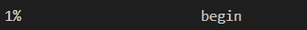

# cli-colorful-progress

> Use colorful progress-bar for command-line/terminal applications.



## Install

```sh
npm install cli-colorful-progress
```

## Usage

```js
const ColorfulProgress = require('cli-colorful-progress')

const maximum = 100
const bar = new ColorfulProgress()
let val = 0
const step = 1
const intervalId = setInterval(function () {
  bar.setProgress({
    current: val,
    leftString: Math.floor((val / maximum) * 100) + '% ',
    rightString:
      ' ' +
      (val > maximum / 2
        ? val === maximum
          ? 'done'
          : 'almost done'
        : 'begin'),
  })
  val = val + step
  if (val > maximum) {
    clearInterval(intervalId)
  }
}, 10)
```

## API

### new ColorfulProgress(options?)

Show a process bar in terminal. Return an instance of process bar.

#### <span id="options">Options Config</span>

Options can be undefined or an object.

```js
{
  // 'minimum' is used to compute progress.
  // It should be a number.
  minimum: 0,

  // 'maximum' is used to compute progress.
  // It should be a number and > minimum.
  maximum: 100,

  // 'current' is used to compute progress.
  // It should be a number, >= minimum and <= maximum.
  current: 0,

  // 'width' defines the progress bar's width.
  // It means the count of space in terminal.
  // It should be an integer and > 0.
  width: Math.floor(process.stdout.columns / 4),

  // 'colors' defines color gradient of progress bar.
  // It should be an array and its length should be >=2 .
  // The items in the array should be a hex string.
  // e.g. ['#9c27b0', '#2196f3', '#b2ebf2']
  colors: ['#f44336', '#ffeb3b'],

  // 'backgroundColor' defines background color of progress bar.
  // It should be a hex string or undefined.
  // When it is undefined, background color of progress bar is transparent.
  // e.g. '#eeeeee'
  backgroundColor: undefined,

  // 'leftString' defines the string on the left of progress bar.
  leftString: '',

  // 'rightString' defines the string on the right of progress bar.
  rightString: '',

  // 'autoDisappear' defines whether the progress bar disappears when the progress is done.
  autoDisappear: false,
}
```

### setProgress(options)

set any parameter of progress bar. <br />
Options defines same as options in ['new ColorfulProgress(options?)'](#options).

## Related

- [chalk](https://github.com/chalk/chalk)
- [javascript-color-gradient](https://github.com/Adrinlol/javascript-color-gradient)
- [log-update](https://github.com/sindresorhus/log-update)
- [mathjs](https://github.com/josdejong/mathjs)
- [supports-color](https://github.com/chalk/supports-color)
